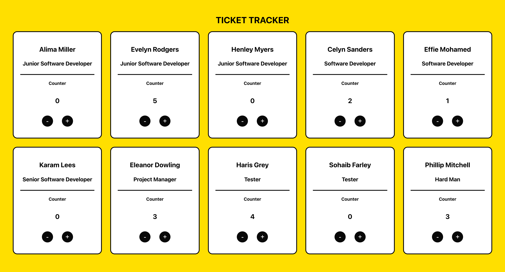

# TOOLS TICKET TRACKER

### Overview
A ticket tracker to keep track of the number of tickets that different members of a tech squad has completed.

### 1. Project's objective
To learn how to use create react app based on components.

### 2. Design and layout
The components are split into the header, ticket tracker container and ticket.

### 3. Technical development

#### 3.1 Technologies
- HTML/HTML5
- CSS/SCSS
- Javascript/React
- IDE PHP Storm

#### 3.2 HTML/HTML5
- Uses HTML5 standards i.e. header and main.

#### 3.3 CSS/SCSS
- The SCSS uses or includes the following:
    - B.E.M methodology for naming classes, and
    - media queries for responsive design.

#### 3.4 Javascript/React
- Functionalities include:
  - {useState} for the counter's increment and decrement, and
  - array iterator map to output the tickets.
  